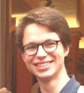

## About Me

Hi! I am a third year Electrical Engineering student at the University of Toronto. I am currently doing an internship as a UAV Performance Engineer at [Verity Studios](http://veritystudios.com/).

## Research Interest

I am interested in the areas of control theory, robotics and machine learning. My preferred areas of research are mathematical in nature.

## Work Experience

Year      | Company                                                                                    | Position
----------|--------------------------------------------------------------------------------------------|-------------------------
2017-2018 | [Verity Studios](http://veritystudios.com/)                                                | UAV Performance Engineer
2016      | [UofT Faculty of Applied Science & Engineering](http://www.engineering.utoronto.ca/)       | Teaching Assistant
2016      | [ETH Zürich LBB](http://www.lbb.ethz.ch/)                                                  | Summer researcher
2015      | [UTIAS-SFL](https://www.utias-sfl.net/)                                                    | Antenna Engineer
2015      | [UofT Reconfigurable Antenna Laboratory](http://www.waves.utoronto.ca/prof/svhum/svh.html) | Summer Reseacher

## Projects

Year      | Organization                                             | Position
----------|----------------------------------------------------------|--------------------
2014-2016 | [UTAT Space Systems](http://utat.skule.ca/?page_id=7735) | Communications Lead

---

Jean le Rond d'Alembert

> allez de l'avant la foi vous viendra

## Publications

1. A. Frutiger, S. Bischof, L. Pahlavi, V. Gatterdam, Y. Blickenstorfer, Janos Vörös and C. Fattinger. ”NALIMA -
Coherent detection of single molecule recognitions: The sensitivity limit of focal molography”. Submitted for
Publication.
